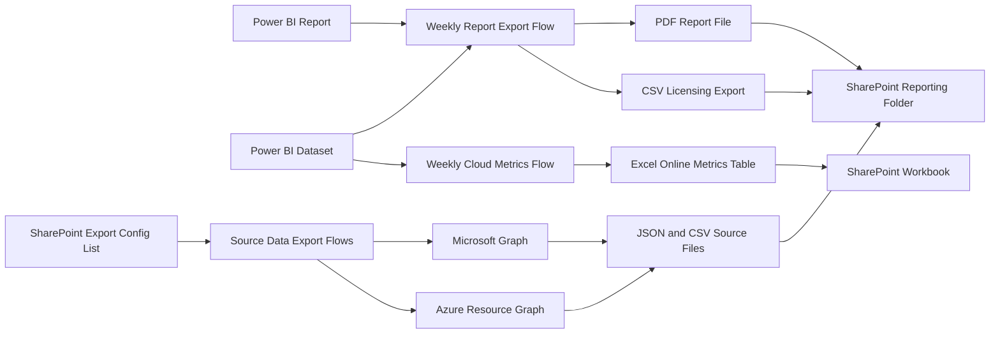

# Microsoft 365 Metrics Export and Reporting Automation

This repository is a sanitized portfolio version of a Power Platform reporting and data-export project I built to automate Microsoft 365 reporting, source-data extraction, and cloud metrics collection into SharePoint and Excel-based reporting assets.

The current portfolio write-up is based on solution version `1.0.0.3`, which extends the earlier weekly Power BI export flows with additional recurring data-export automation for Microsoft Graph reports, Graph JSON endpoints, Azure Resource Graph queries, Microsoft 365 user inventory, and group metrics.

## Project Summary

Teams often need regular Microsoft 365 reporting for capacity planning, licensing, operational review, and source-data extraction, but manual export processes create a few common issues:

- weekly reports are easy to forget or delay
- PDF snapshots, CSV extracts, and raw source-data files are often exported separately by hand
- dashboard metrics are hard to preserve historically
- API-based exports are difficult to standardize across different data sources
- reporting consistency depends too much on one person doing the work

I designed this solution to automate that process. It exports a Power BI report to PDF, extracts licensing data from a Power BI dataset to CSV, writes key Microsoft 365 cloud metrics into a structured Excel table, and uses a SharePoint-driven configuration list to export additional Microsoft 365 source data from Microsoft Graph and Azure Resource Graph into reusable files.

## Business Value

This project demonstrates how I automate reporting workflows so business teams get consistent outputs with less manual effort.

- Reduced manual reporting work for weekly Microsoft 365 exports and source-data refresh
- Standardized how PDF and CSV outputs are generated and stored
- Captured cloud metrics in a structured table for historical tracking
- Improved reporting reliability through scheduled automation
- Connected dashboard data, API exports, and reusable reporting assets in SharePoint

## What The Solution Does

The `1.0.0.3` solution includes four recurring flows:

1. Export Microsoft 365 report every week
   Exports a Power BI report to PDF, saves it to SharePoint, queries licensing data from the dataset, converts the results to CSV, and saves that file alongside the report.

2. Export cloud metrics every week
   Queries key Microsoft 365 operational metrics from Power BI and appends them into an Excel table stored in SharePoint for ongoing metric history and dashboard support.

3. Get M365 metrics users
   Pulls Microsoft 365 user inventory through Microsoft Graph, handles paged results, and writes the exported user dataset into SharePoint-managed source files.

4. Get M365 metrics source data without users
   Reads enabled export definitions from a SharePoint control list and runs different export patterns for Graph CSV reports, Graph JSON endpoints, Azure Resource Graph queries, and curated group metrics before saving the output files to SharePoint.

## Main Capabilities

- weekly Power BI report export to PDF
- weekly M365 licensing dataset extraction to CSV
- SharePoint file storage for scheduled reporting outputs
- Excel Online table updates for metric history
- recurring collection of operational cloud metrics such as storage, site counts, activity, and active user counts
- config-driven export of Microsoft Graph CSV and JSON source data
- Microsoft 365 user inventory export with paging support
- Azure Resource Graph export for cloud source-data collection
- group metric export for key tenant membership segments

## Core Workflow

High-level process:

1. A weekly recurrence trigger starts the reporting flow.
2. A Power BI report is exported to PDF.
3. The PDF file is saved into a SharePoint reporting folder.
4. A Power BI dataset query extracts licensing details into a tabular result set.
5. The result set is converted into CSV and saved to SharePoint.
6. A separate weekly flow queries operational cloud metrics from the same reporting environment.
7. Those metrics are appended to an Excel table for trend tracking and analysis.
8. A SharePoint configuration list identifies additional APIs and export targets to run.
9. Microsoft Graph and Azure Resource Graph source data are collected and written to SharePoint files.
10. Export status is updated in SharePoint so recurring jobs can be tracked centrally.

## Architecture

## Reporting Scope

Based on the exported queries and source-data flows, the automation captures reporting such as:

- subscribed Microsoft 365 SKU and seat data
- enabled, suspended, warning, and available seat counts
- tenant storage utilization
- SharePoint usage
- OneDrive usage
- Exchange or Outlook storage usage
- SharePoint site counts
- Teams site counts
- email activity counts
- active student and staff counts
- Microsoft 365 user inventory details
- Graph report CSV outputs configured by period and method
- Graph JSON endpoint outputs for reusable source-data collection
- Azure Resource Graph results for cloud inventory and related metrics
- group membership counts for selected enterprise groups

## Technical Highlights

- Used the Power BI connector to automate both report export and dataset query execution
- Delivered both PDF and CSV outputs from the same reporting pipeline
- Appended metric data into an Excel Online table to support historical trending
- Stored outputs in SharePoint so stakeholders could access files without depending on local storage
- Scheduled the reporting workflow to run weekly for consistent delivery
- Designed the cloud-metrics flow to convert dashboard measures into structured operational records
- Added a config-driven source-data export model controlled from SharePoint rather than hardcoding every export path
- Used Microsoft Graph and Azure Resource Graph to expand the reporting platform beyond Power BI-only outputs
- Built paged user export logic so large Microsoft 365 datasets could be collected reliably

## Tech Stack

- Microsoft Power Platform
- Power Automate
- Power BI connector
- SharePoint Online
- Excel Online (Business)
- Microsoft Graph API
- Azure Resource Graph
- Azure Key Vault

## Engineering Decisions

A few design choices were especially important in this project:

- Separate presentation and data exports: the solution produces both a human-readable PDF and reusable data exports
- Excel table for trend history: operational metrics are appended into a structured workbook instead of staying trapped in one dashboard view
- SharePoint as the shared delivery point: exported files are stored where teams can access and organize them centrally
- Query-driven reporting: using dataset queries makes the automation more consistent than manual filtering and export steps
- Configuration-driven source exports: a SharePoint list controls which APIs run and where files are written
- API diversity with one delivery pattern: Graph, Azure Resource Graph, Power BI, SharePoint, and Excel are unified into one reporting workflow

## Repository Contents

This is a portfolio case study, not a production deployment repository.

- `README.md`: project overview and architecture summary
- `public-safe-checklist.md`: notes on values removed for public sharing
- `docs/`: place for screenshots, diagrams, and supporting notes

## Confidentiality Note

The original solution package includes private Power BI workspace, report, dataset, SharePoint, and Excel identifiers tied to a real Microsoft 365 reporting environment, along with Microsoft Graph and Azure Resource Graph export configuration stored in SharePoint and secrets referenced through Azure Key Vault. This public version focuses on the automation design and reporting workflow rather than publishing raw production configuration.

## Why This Project Matters In My Portfolio

This project highlights the kind of reporting automation work that is valuable in Power Platform, Microsoft 365, cloud operations, and business intelligence support roles:

- turning recurring manual reporting into scheduled automation
- connecting Power BI, SharePoint, Excel, and API-based exports into one reporting pipeline
- designing for historical tracking instead of one-time export
- building practical operational reporting that other teams can reuse

## Next Improvements

Planned additions to this portfolio repo:

- redacted screenshots of the exported report folder
- a sample sanitized CSV output
- a screenshot or diagram of the Excel metrics table
- a sample sanitized JSON source-data export
- impact notes such as reporting frequency or hours saved
